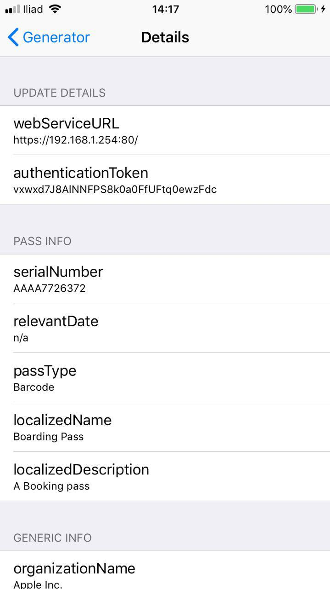

# Passkit Sample Client

An experimental client to fetch, show and add a Pass to Apple Wallet.
This experiment application is based on [passkit-generator](https://github.com/alexandercerutti/passkit-generator), a package made by me to create passes in Node.JS by using a model.

It can be virtually used for all back-end pass generators that returns a string or a JSON structure (to be implemented) as error or a buffer with `application/json` as MIME and have the same Endpoint to return a pass (i.e. `<address>/gen/<selected-pass-type>`).

This application asks for an URL to be inserted and a pass type to be selected from the main *UIPickerView*.
The request will be done on the following Endpoint: `<url>/gen/<selected-type>`.
Once retrieved the pass, it will let inspect its properties on another View Controller.

#### Screenshots

	
	

